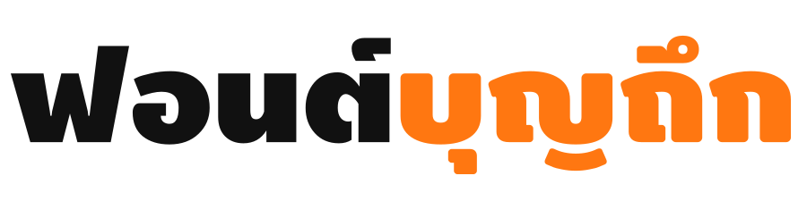

{: .banner}

**บุญถึก** เป็นฟอนต์ตระกูลหนาน้ำหนักเดียวแต่มี 4 สไตล์ คือ บุญถึกตรง, บุญถึงเอน, บุญถึกมน และ บุญถึกมนเอน ชื่อฟอนต์คงบ่งบอกบุคลิกได้ดีโดยไม่ต้องบรรยาย ถึงแม้ตัวจะหนาแต่ก็ดูไม่มีพิษมีภัย เปรียบเทียบได้กับตัวละคร Hodor ใน Game of Thrones หรือ Lennie Small ในนิยาย Of Mice and Men ของ John Steinbeck และ **ฟอนต์อยู่นี่** ก็ใช้บุญถึกในโลโก้นั่นเอง

-----

### ๏ ภาษาที่รองรับ
{: .boontook-mon}

นอกจากตัวอักษรไทยแล้ว ฟอนต์บุญถึกตั้งแต่เวอร์ชั่น 2.0 ขึ้นไปยังมีตัวอักษรละตินครอบคลุมมากกว่า [Adobe Latin-4](https://adobe-type-tools.github.io/adobe-latin-charsets/adobe-latin-4.html) นั่นคือครอบคลุมเกือบทุกภาษาในยุโรป อเมริกา รวมถึงภาษาเวียดนามด้วย

-----

### ๏ ทดสอบการแสดงผล
{: .boontook-mon}

[หน้าทดสอบ OpenType features](features.html) เป็นสไลด์โชว์ที่เปลี่ยนสไตล์ของฟอนต์ได้ตรงมุมบนด้านขวาสุดในหน้านั้น

-----

### ๏ ความเปลี่ยนแปลงในแต่ละเวอร์ขั่น
{: .boontook-mon}

คุณสามารถอ่านได้จาก [FONTLOG](FONTLOG.html)

-----

### ๏ สัญญาอนุญาต
{: .boontook-mon}

&copy; ๒๕๕๗-๒๕๕๘ [สังศิต ไสววรรณ](https://sungsit.com/)

**ฟอนต์บุญถึก** ใช้สัญญาอนุญาต (license) แบบ [SIL Open Font License v1.1](http://scripts.sil.org/OFL) แปลว่าคุณมีอิสระเต็มที่ในการใช้งาน ดัดแปลง หรือปรับปรุง เงื่อนไขคือเมื่อดัดแปลงจากต้นแบบแล้วอยากจะเผยแพร่ผลงานใหม่ก็ต้องใช้สัญญาอนุญาตแบบเดียวกันและต้องเปิดเผยซอร์สโค้ดเช่นกัน

-----

[๏ ดาวน์โหลดบุญถึก ๛](https://github.com/fontuni/boontook/releases)
{: #download .boontook-mon}

-----

### ๏ แจ้งปัญหาการใช้งาน
{: .boontook-mon}

หากคุณพบปัญหาในการใช้งานฟอนต์บุญก็สามารถแจ้งกันเข้ามาได้ที่ <https://github.com/fontuni/boontook/issues> หรือพูดคุยอย่างกันเป็นเองที่ [ชุมชนสาวก f0nt](http://www.f0nt.com/forum/index.php/topic,21990.0.html) **ขอขอบคุณ สาวก f0nt ทุกท่านที่ให้ความเห็นและช่วยทดสอบฟอนต์บุญไว้ ณ ที่นี่ด้วยครับ** ([หน้าปล่อยฟอนต์เริ่มแรก](http://www.f0nt.com/release/boontook/) ก็อยู่ใน f0nt.com นั่นเองครับ)

